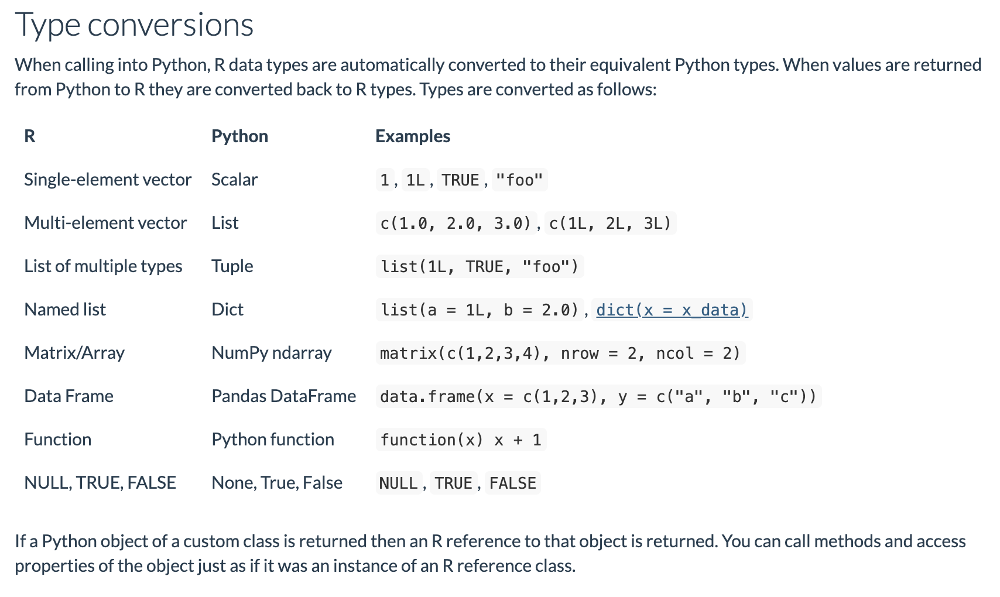

# boto3 and Python

This package is built off of `boto` and `reticulate`. Once you have successfully installed `biggr`, you immediately have complete access to AWS, though in a somewhat complicated form. Let's send ourselves a text message.

```{r, message=FALSE, warning=FALSE}
library(biggr)
library(reticulate)
library(tidyverse)
```

Use the `boto3` function to gain access to the underlying Python module.
```{r, cache=TRUE}
boto = boto3()
```

Following the tutorial located [here](https://bradmontgomery.net/blog/sending-sms-messages-amazon-sns-and-python/), we see how incredibly powerful this package could be.

More or less, to write Python in R all you need to do is replace the .'s with $'s However it's good to know type conversion between the two languages. This is taken from the reticulate documentation. 



Client is the lowest level within the boto module, read more about it [here for sns](https://boto3.amazonaws.com/v1/documentation/api/latest/reference/services/sns.html#client).
```{r, cache=TRUE}
client <- boto$client('sns', region_name='us-east-1')
```

```{r, cache=TRUE}
response <- client$publish(
    PhoneNumber="+15555555555",
    Message="Hello World!!!!"
)
```

The AWS responses are pretty dirty. This is one of the issues I'm working on. We can take the response and clean it up for others.
```{r, cache=TRUE}
response 
```

While this is simplified, an R user will find this much more intuitive.
```{r, cache=TRUE}
send_sms <- function(phone_number = NA, 
                     message = "Hello World!", 
                     region = "us-east-1",
                     message_aws = FALSE) {
  client <- boto$client('sns', region_name=region)
  phone_number <- paste0("+", phone_number)
  response <- client$publish(
      PhoneNumber = phone_number,
      Message     = message
  )
  if(message_aws) {
    return(response)
  } else {
    return(TRUE)
  }
}

```

Doesn't this just seem a lot better? Wrapping up the most useful parts of Python code into R is the first step.
```{r, cache=TRUE}
send_sms(phone_number = 15555555555, message = "Hi, how are you?")
```
